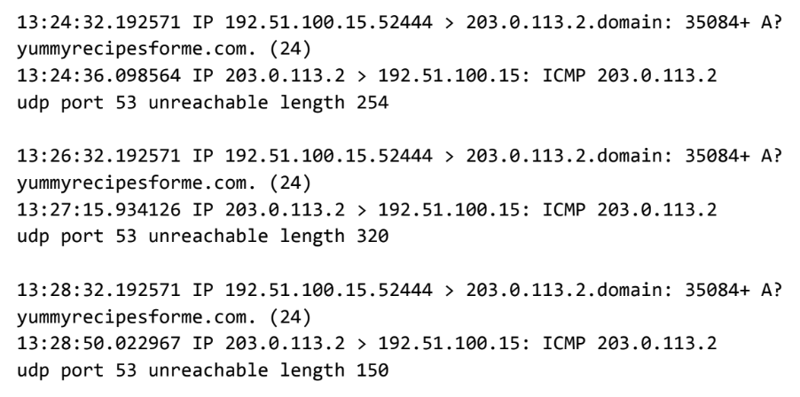

# Análisis de Tráfico de Red con Tcpdump

Análisis de paquetes de red e identificación de fallos de conectividad DNS/ICMP.

---

## 📝 Descripción del Incidente
Se reportó una falla de conectividad hacia el servidor con la dirección IP `203.0.113.2`. El objetivo de este análisis fue inspeccionar la captura de tráfico para determinar la causa raíz del problema.

> **Nota de contexto:** Este laboratorio se realizó mediante la inspección y análisis visual de registros de red provistos por el entorno de práctica de Coursera (Google Cybersecurity Professional Certificate).

---

## 🖼️ Captura de Tráfico Analizada

---

## 🔍 Hallazgos y Diagnóstico
- **Observación del tráfico:** Se detectaron intentos de conexión hacia el servidor, los cuales fueron respondidos con un rechazo mediante mensajes ICMP (*Destination/Port Unreachable*).
- **Conclusión técnica:** El rechazo ICMP indica que el puerto de destino está cerrado o que un firewall está bloqueando activamente las solicitudes entrantes.

---

## 🛠️ Solución y Recomendaciones
Para restablecer el servicio, se proponen las siguientes acciones de mitigación:

1. **Verificar el servicio DNS:** Comprobar si el servicio DNS está en ejecución en el servidor `203.0.113.2` y proceder a reiniciarlo si es necesario.
2. **Revisar reglas del Firewall:** Inspeccionar las políticas del firewall para asegurar que no se esté bloqueando el tráfico legítimo hacia el puerto del servicio.
